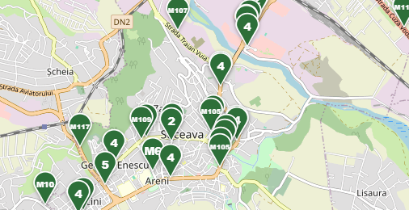
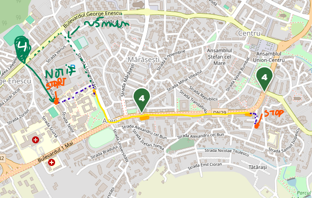

# Suceava Bus Tracker 

## The problem
The current bus tracker platform gives us only the position of the bus, no advanced features that helps user to get to bus in time or to optimize their travel.
 This is how it looks right now. A citizen must zoom it to check where the bus it and that's the only information available. 

## The solution
- user can add custom routes by days (work days at 8:00 AM must be on X and leave at 5:00 PM to Y place)
- the app will notify the user when a bus is near the station and will tell him when to leave so he can get in time.
 This is a simple example. Bus is coming, user gets a notification based on ETA.

## Other features
- Bus data analytics for administration (heatmaps, days comparison so it can add more buses based on history)
- Petition system from user to administration
- Admin page that can change routes over time/ add new routes.
- News feed for changes.

## Where do we get data from:
`https://info.tplsv.ro:7443/?ajax=get_bus_data&t={timestamp}` gives us bus positions.
The response shape:
```
{"thoreb": "<json string>", "karsan": ""}
inner: { "<vehicleId>": {"1":"on|off", "2":"lat", "3":"lon", "4":"line"} }
```
- `4` can be `2`, `4`, `M114`, `NO_LINE`, `NO_LINE`-like, or empty (off route).
- Some ids are numeric (`0464`), some are plates (`SV67PMS`).
- Lat/lon `0.00000` = no GPS fix, discard.
- Response is ~8.7 kB, the official app polls every ~1.3 s.

## How it works 
A server reads the bus feed every few seconds and saves positions. From the saved history it learns how fast each line runs at each hour (for example, slow at 7-8 AM). When a user's plan is active, it picks the best bus and sends `get ready` and `leave now` notifications.

## Missing data
The feed has bus positions only: no stops, no route shapes
We can map the needed data like this:
- Stops: from OpenStreetMap, checked agains where buses actually stop.
- Routes: learned from recorded bus traces per line.
- When/Where line starts: some buses start at a fixed time and may not show up in the feed before leaving. The app records a timetable from that (e.g. line 4 leaves at 7:15, 7:35) and uses it to plan until the live bus appears.

## Stack
- Django (users, admin, history data)
- FastAPI (live data, alerts) 
- Postgres, Redis
- PWA (installable web app)

## MVP 
- live map filtered by line
- login and custom routes with schedule
- `Leave now` notifications

## Risks
- the feed is unofficial and may change or be blocked. 
- ETA are only as good as the recorded data, so recording starts first.