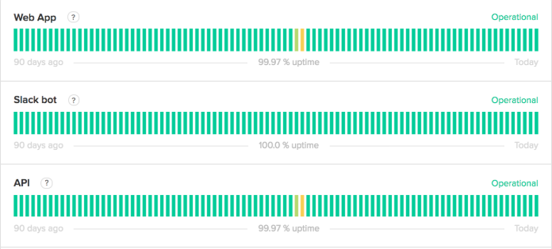
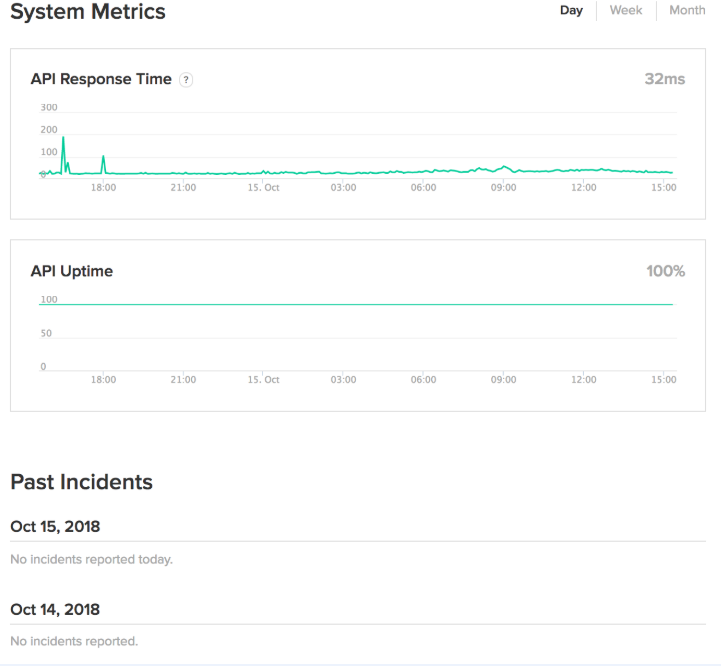

# Uptime Monitor (mini Better Stack / Statuspage)

## The problem
When a website or API goes down, the owner often finds out from angry users. Small teams don't have a simple, cheap way to know a service is down, get alerted fast, and tell their users what is happening.

## The solution
- User adds checks: an HTTP URL or a TCP host and port.
- Workers run each check every 30 seconds to 5 minutes.
- When a check fails, the app opens an incident and sends alerts (email, Slack, webhook).
- A public status page shows the current state of each service and its history.

## Other features
- Uptime % and response time graphs per check
- Teams: organizations, users and roles
- API keys, so checks can be managed from code
- Maintenance windows (no alerts during planned downtime)
- Live updates on the dashboard
- SSL certificate expiry warning

## How it works
A scheduler decides which checks are due and puts them in a queue. Workers take jobs from the queue, run the check, and save the result. If a check fails several times in a row, the app opens an incident, sends alerts, and closes the incident when the check passes again. Failures must be confirmed (for example 3 in a row) so one slow response doesn't wake someone at 3 AM.

| | FastAPI: Monitoring Engine | Django/DRF: Platform API |
|---|---|---|
| Owns | Scheduler, check runners, results, incident detection, alert sending with retries | Orgs, users, roles, API keys, check config, status pages, incident history, admin|
| Data | High-volume results, Redis queues | Relational core, migrations, audit log |

Swap ownership of one feature each around week 5, so both people touch both stacks.

## Tech
Django/DRF (platform), FastAPI (engine), Postgres, Redis, Docker Compose. Frontend: a dashboard and a public status page, with WebSocket for live updates.

## MVP (first version)
- Login, one organization, add and edit HTTP checks
- Scheduler and runners, saving every result
- Incident opened on repeated failures, closed on recovery
- Email alert
- Simple public status page

Everything under "Other features" comes after.

## Risks
- **Flapping**: a service that goes up and down creates alert spam. Fix: confirm failures and add a cool-down.
- **Result volume**: 1,000 checks every 30 seconds is about 2.8 million results per day. Fix: partition tables by day and keep raw data for a short time.

## Statuspage

